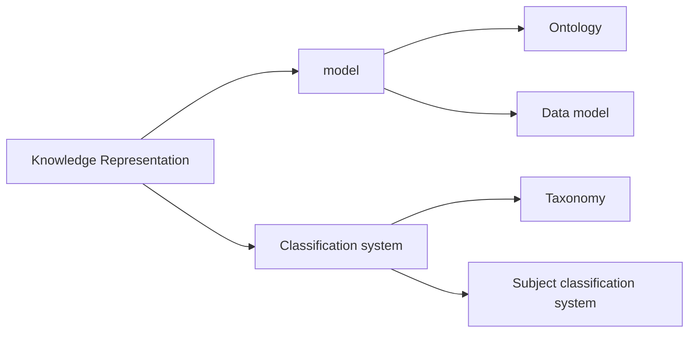

#  Knowledge Representation 

| Concept               | Synonym                       | Characteristics                   | Definition                                                 |
| --------------------- | ----------------------------- | --------------------------------- | ---------------------------------------------------------- |
| Model                 |                               | Purpose: Knowledge Representation | Simplified representation of knowledge about the phenomena |
| Ontology              | concept model, concept system | Description: concepts             | Model for the description of knowledge about concepts      |
| Data Model            |                               | Description: Data                 | Formal model for the description of data in an IT system   |
| Classification System | classification                | Purpose: Classification           | system for the division of phenomena into classes          |
| Taxonomy              | subject classification        | Purpose: categories               | classification system for the phenomena into subject fields                                                           |

We start with a generalised term and keep getting more and more specific.

Almost anything may be classified according to some taxonomic scheme, as long as there's a logical hierarchy. Moving "up" in taxonomy leads to more generic terms moving down - more specific.

Formal taxonomies example - species classification taxonomy. 
